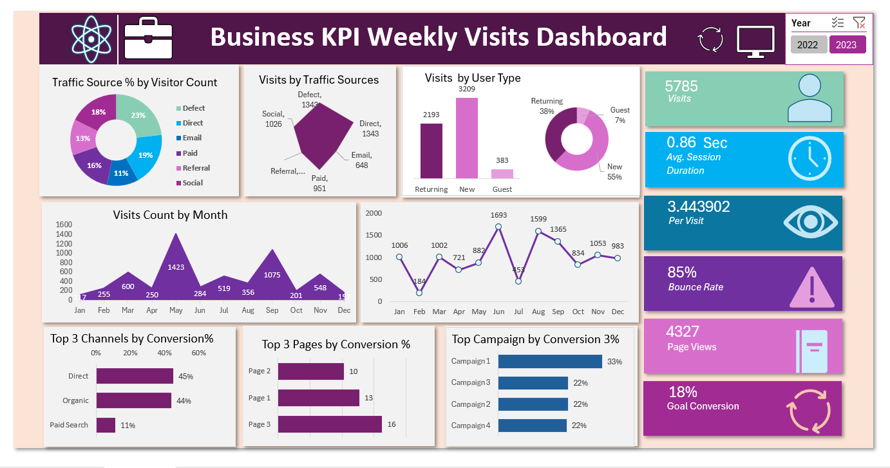

# Excel-Web-Traffic-Dashboard
Interactive Excel Dashboard project analyzing website traffic, visitor behavior, and conversions. Built using Pivot Tables, Slicers, and Charts for data-driven insights
# 📊 Excel Web Traffic Dashboard  

  
  
  

---

## 📌 Overview  

This project is an **interactive Excel dashboard** that analyzes website traffic, visitor behavior, bounce rates, and conversions.  

I created it as part of my **Data Analyst learning journey** to practice:  
- Cleaning raw data  
- Using Pivot Tables & Slicers  
- Building a dashboard that transforms data into **business insights**  

---

## 🚀 Features  

✔️ KPIs: **Total Visits, Avg. Session Duration, Pages per Visit**  
✔️ Visitor Segmentation: **New vs Returning**  
✔️ Conversion Analysis by **Channel, Campaign, and Page**  
✔️ Bounce Rate & Engagement Metrics  
✔️ Monthly Trend Analysis  
✔️ Interactive filters with **Slicers**  

---

## 🛠️ Tools & Skills  

- **Microsoft Excel**  
  - Pivot Tables & Pivot Charts  
  - Slicers & Filters  
  - Conditional Formatting  
- **Data Cleaning & Preprocessing**  
- **Dashboard Design & Visualization**  

---

## 📂 Files in this Repository  

- `Dashboard.xlsx` → Main Excel Dashboard  
- `Project_Presentation.pptx` → PPT Presentation  
- `README.md` → Documentation (this file)  

---

## 📊 Data Description  

- **Website Traffic Metrics** → Visits, Bounce Rate, Session Duration  
- **Visitors** → New vs Returning  
- **Conversions** → Channels, Campaigns, Pages  
- **Timeline** → Monthly data  

---

## 📷 Dashboard Preview  

(Add screenshot here after uploading: `Dashboard.png`)  

  

---

## 🔑 Key Insights  

- **Direct & Paid traffic** generated higher conversion rates.  
- **Returning visitors** engaged more deeply than new visitors.  
- **Campaign 1** outperformed others in conversions.  
- Bounce rate was higher in **some channels** → opportunity to improve user experience.  
- Monthly patterns showed **seasonal spikes and dips** in traffic.  

---

## 🎯 Conclusion  

Through this project, I:  
- Learned to turn raw data into actionable insights  
- Built an **interactive Excel dashboard** with Pivot Tables & Slicers  
- Strengthened my **data visualization & storytelling skills**  
- Prepared myself for **Data Analyst internship opportunities**  

---

## 👨‍💻 About Me  

I’m **Seema Kumari**, a fresher aspiring **Data Analyst** passionate about solving problems with data.  
This project is part of my journey to build strong skills in **Excel, SQL, and Power BI**.  

📫 Connect with me on [LinkedIn](https://www.linkedin.com/in/seema-kumari-375763308/)  

---
